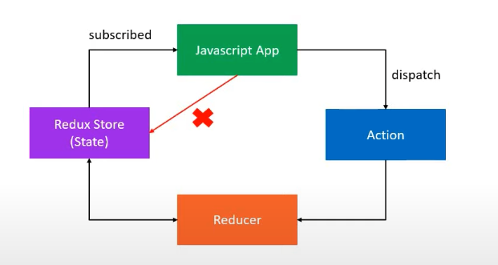

# React-Redux Fundamentals

- Redux is a predictable state container for JS apps.

1) is for JS application not tied to React, and can be used with any other JS libraries.

2) it is a state container, i.e stores the state of the application.
  - the state of the application is the state represented by all the individual components of the app.
  - redux will store and manage the application state.

3) it is predictable.
  - the changes to the application state is predictable.

  ** React-Redux is the official Redux UI binding library for React

*************************************
### Entities:

- shop -> stores cakes on a shelf
- shopkeeper -> at the front of the store.
- customer -> at the store entrance.

### Activities:

- customer -> buy a cake
- shopkeeper -> remove a cake from the shelf
             -> receipt to keep track.
*************************************


## Three core principles for Redux:

1) The state of your whole application is stored in an object tree within a single store.
  - maintain the application state in a single object which would be managed by the Redux store.

2) The only way to change the state is to emit an action, an object describing what happened.
  - to update the state of the app, you need to let Redux know about that with an action.
  - not allowed to directly update the state object.
  ```
    {
      type: BUY_CAKE
    }
  ```

3) To specify how the state tree is transformed by actions, you write pure reducers.
  ```
    Reducer - (previousState, action) => newState.
  ```

### Redux Architectural Pattern:



### Redux Store:

> Responsibilities::

- Holds the application state
- Allows access to state via getState()
- Allows state to be updated via dispatch(action)
- Registers listeners via subscribe(listener)
- Handles unregistering of listeners via the function returned by subscriber(listener)
